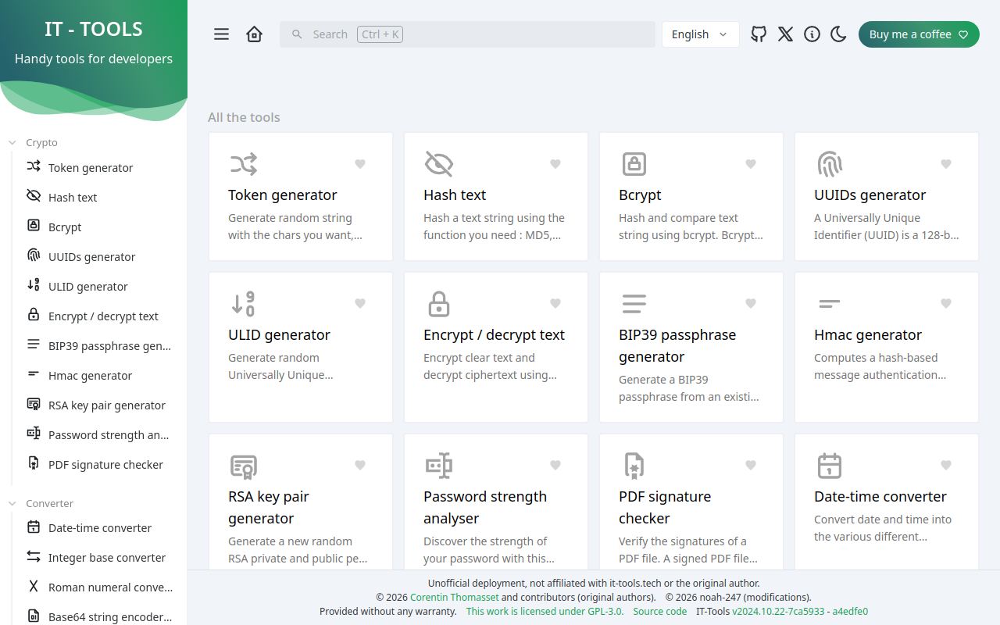
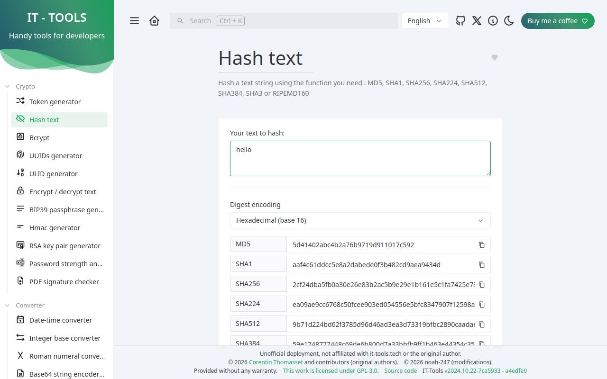
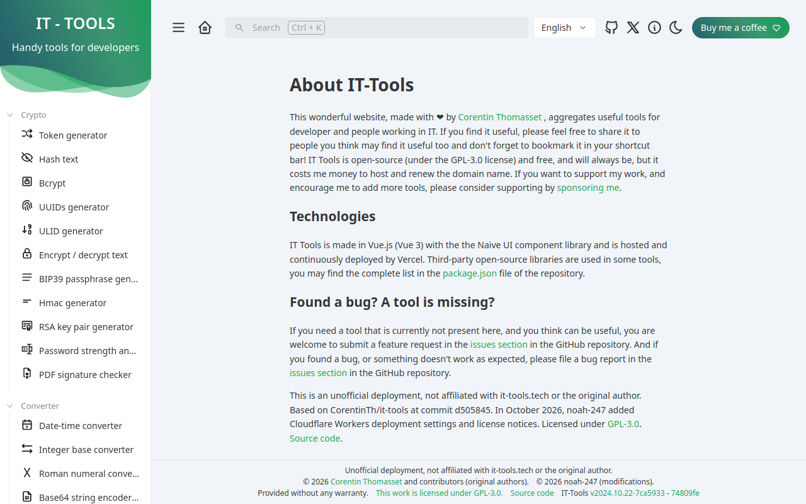

<picture>
    <source srcset="./.github/logo-dark.png" media="(prefers-color-scheme: light)">
    <source srcset="./.github/logo-white.png" media="(prefers-color-scheme: dark)">
    
</picture>

> ⚠️ **這是非官方部署**（unofficial community build）
> 原專案是 [CorentinTh/it-tools](https://github.com/CorentinTh/it-tools)，作者 Corentin Thomasset，credit 都歸他。
> 這裡只是 fork 下來，改跑在 Cloudflare Workers 上。

## 直接開來用 👇

**https://ittools.voidez.com**（正式域名）

備用：https://noah-it-tools.pagi.workers.dev（workers.dev 預覽網址，功能一樣）

86 個開發者小工具，全部在瀏覽器裡運算。免註冊、免登入，打開就有。



## 用起來長這樣

以 Hash text 為例：貼上文字，SHA-256 馬上算出來（下圖是實際算出 "hello" 的結果）。



## About 頁也有寫清楚



頁尾的授權聲明實際長這樣（順手拍一張）：


## 想自己架一份

`wrangler.toml` 已經在 repo 裡了（純靜態託管，assets-only，不用寫 Worker 程式）：

```sh
pnpm install --frozen-lockfile          # Node 18，pnpm 9
BASE_URL=/ VITE_VERCEL_ENV=production VITE_TRACKER_ENABLED=false \
  VITE_VERCEL_GIT_COMMIT_SHA=$(git rev-parse HEAD) pnpm build
npx wrangler deploy
```

`VITE_TRACKER_ENABLED=false` 是建置時關掉追蹤；`VITE_VERCEL_GIT_COMMIT_SHA` 會顯示在頁尾，方便對版本。

## 授權

GPL-3.0 —— `LICENSE` 在 repo 根目錄。

原始碼：https://github.com/noah-247/it-tools
部署版本以 tag `a-deploy-4` 為準。
